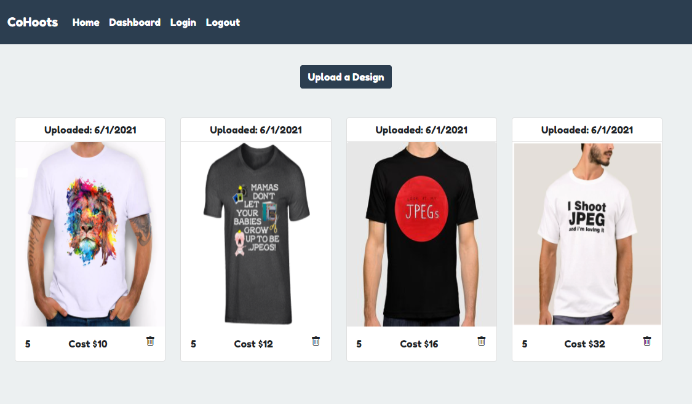

# CoHoots
    
## Table of Contents
* [Description](#description) 
* [Installation](#installation)
* [Usage](#usage)
* [Contributors](#Contributors)
* [License](#license)
* [Badge](#badge)
* [Questions](#questions)
    
## Description
* Collaboration website for custom T-Shirt designs.
    
## Installation
* Online webite with no installation necessary.  Website can be accessed with any modern web browser.
    
## Usage
* Online website is designed for users to login and upload their designs for custom t-shirts.  Simply log in or create your account to upload your own design. Also, feel free to comment on your friend's designs as well!

[CoHoots Website](https://cohoots.herokuapp.com/)

    
## Contributors
* Salome Ranson, Braxton BodenHamer, Karen Roh, Kristopher Lucas
    
## License
* Licensed by mit
    
## Badge
* 
    
## Questions
* For any questions, concerns, or additional help, please contact braxb92@gmail.com, karenroh@hotmail.com, salomeranson@gmail.com, klucas72@hotmail.com.